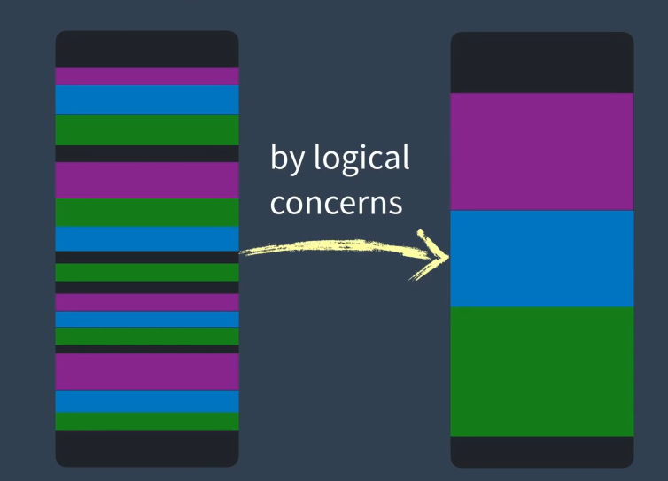

# Vue3 vs Vue2

## 更快

更快的虚拟dom算法，源自编译模板时给予更多的运行时提示

传统的虚拟dom算法：组件patch的时候，需要重新创建整个vdom树，然后遍历整棵树进行diff，update
全新的更新策略：

1. 编译模板时对动态内容进行patch标记，告诉patch算法只关注被标记的动态部分

2. 对静态内容进行静态提升（变量提升），页面初始化时渲染一次，其余时候不再渲染

3. 对事件监听函数进行缓存

   ......

[模板编译器](https://vue-next-template-explorer.netlify.app)


## 更小

### 全局API
全局 API 现在只能作为 ES 模块构建的命名导出进行访问。

#### Vue2
Vue.nextTick（this.$nextTick）、Vue.set、Vue.delete ...

#### Vue3
import { nextTick, set, delete, ... } from 'vue';

nextTick();

### 内部组件

transtion组件、keepAlive组件、 ...

经complier编译后

import { transtion, keepAlive, ... } from 'vue'

### 内部helper
v-show、... 

complier编译后

import { vShow, ...  } from 'vue'

意味着只有在应用程序实际使用了某个API或者组件的时候才会导入它。没有使用到的功能代码将不会出现在最终的构建包中。框架体积还会成为选择框架的考虑因素吗？


## 更友好
#### VUE2组件现存的缺陷

1. 组件越来越大，可读性和可维护性越来越差。根本原因在于Vue使用的option API：迫使你必须按配置(options)来组织代码，你需要把一个功能的实现分布在各个配置里：data，computed，watcher，methods，但是在某些情况下按功能来组织代码更合理。如果要在一个很大的组件中修改一个功能，就要跳到各个属性找，如果组件里面还用了mixins，还得跳文件看

2. mixins无法特别好的在多个组件中复用同一段代码  
    mixins有什么问题？
    可读性太差，得跳到mixins所在的文件中才能知道它到底有什么
    不同的mixins容易冲突
    
    复用其他同伴的mixins的时候，有些代码不合自己的预期，但是又不敢改。。。
    
3. ~~对typeScript的支持有限~~

#### 使用componsition API
什么时候使用componsition API？



  1. 如果你有一个很大的组件，想要按功能来聚合代码。
 2. 如果你想要复用组件的一部分代码。
 3. 如果你想要更好地支持typeScript

```javaScript
import useFeature1 from '../use/useFeature1';
import useFeature2 from '../use/useFeature2';

export default {
  setup() {
    const { data1, data2, method1, computed1, ... } = useFeature1();
    const { data3, data4, method2, computed2, ... } = useFeature2();
    // do something
    return { data1, data2, method1, ... };
  }
}
```
上面这段代码做到了：按功能组织代码，想要修改某个业务逻辑时，不需要满大街找散布各地的数据和方法了，响应式属性与组件解耦，自由控制需要成为响应式的以及需要暴露给模板的属性

setup内的代码只依赖于传入的参数和全局引入的Vue API，而不是特殊修改过的`this`。所以只需要导出你想要复用的功能函数。甚至可以导出整个`setup`函数去实现“类似”继承的效果（把组件A的`setup`放进组件B的`setup`里，B就有了A的所有功能）。。。


#### 两种创建响应式属性的API

##### ref: 为传入的值封装一个响应式对象，通过value属性访问与设置对象的值

```javaScript
setup() {
  const capacity = ref(3);
  const attending = ref(['tim', 'Bob', 'Joe']);
  watch(capacity, () => {
    console.log('capacity changed!');
  });
  watch(attending, () => {
    console.log('attending changed!');
  });
  onMounted(() => {
    capacity.value += 1; // capacity changed!
    attending.value[0] = 'Jack'; // ?
    // 通过ref封装的响应式对象无法进行深层监听
  });
  return { capacity };
}
```

##### reactive: 让传入的对象成为响应式对象
```javaScript
setup() {
  const event = reactive({
    capacity: 3,
    attending: ['tim', 'Bob', 'Joe'],
  });
  watch(event, () => {
    console.log('something changed!');
  });
  onMounted(() => {
    event.attending[0] = 'Jack'; // something changed!
  });
  return { event };
}
```


#### 其他API

##### watchEffect

```javascript
setup() {
  const capacity = ref(3);
  const attending = ref(['tim', 'Bob', 'Joe']);
  const stop = watchEffect(() => {
    console.log(capacity.value + attending.value.length);
  })
  onMounted(() => {
    capacity += 1; // 1
  });
  return { capacity, attending, stop };
}
stop(); // 停止监听
```

[更多参考官方文档](https://vue3js.cn/docs/zh/api/)


#### compisition API的下一步

##### 现存的缺点

1. ref和reactive太像了，初上手时很难决定到底用哪个。
2. 没有了options的限制，一不小心就可能会写出比使用option API更加臃肿难读的代码
3.  使用Composition API时，需要区分哪些值或者对象是响应式的，哪些不是。
4. 阅读或者修改ref会有点麻烦，因为必须通过`.value`才能实现。
5. 一旦组件需要使用的数据多起来，import和return语句就会很冗长。

##### 下一步

[New script setup and ref sugar](https://github.com/vuejs/rfcs/pull/222)

前阵子，Vue3.0提出了两个新提案

```javascript
<script>
import { ref } from 'vue'

export default {
  setup() {
    const count = ref(1)
    const inc = () => { count.value++ }

    return { count, inc }
  }
}
</script>
```


**script-setup 提案，将 options.setup 提取到代码顶层。**

```javascript
<script setup>
import { ref } from 'vue'

const count = ref(0)
const inc = () => { count.value++ }
</script>
```


**ref-sugar 提案，将 ref.value 的写法，做进一步简化。**

```javascript
<script setup>
ref: count = 1
const inc = () => { count++ }
console.log($count.value)
</script>
```


## 其他变化

#### 不再支持keyCode修饰
```javaScript
<input v-on:keyup.13="handleEnter"></input>
```
替换为
```javaScript
<input v-on:keyup:enter="handleEnter"></input>
```


#### 过渡类名变更
.v-enter => .v-enter-from

.v-leave => .v-leave-from

#### v-model变更
可使用多个v-model, 不再需要.sync修饰符来进行双向绑定了
```javaScript
<ChildComponent v-model:title="pageTitle" />
```
```javaScript
<ChildComponent :title="pageTitle" @update:title="pageTitle = $event" />
```

#### 更多

Vue认为$ on，$ off 和 $once 实例方法不应该由它来提供，因此Vue3将它们移除了

过滤器filters被移除了，需要使用计算属性或方法来代替

新增Suspence组件 => 组件loading完成前显示后备内容

新增teleport组件（portal） => 允许传送组件内容到根节点以外的任何地方
...